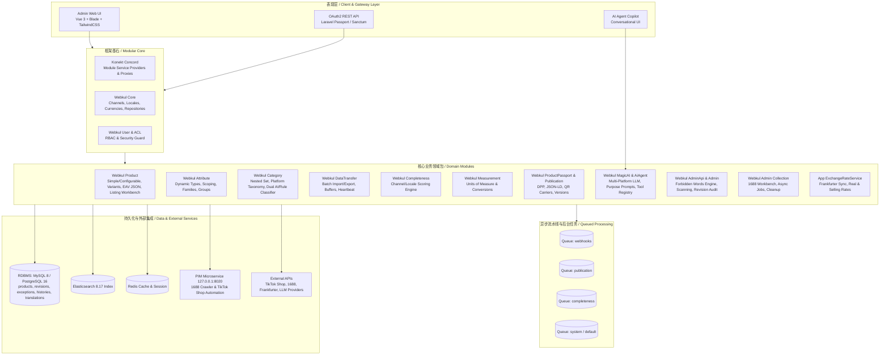
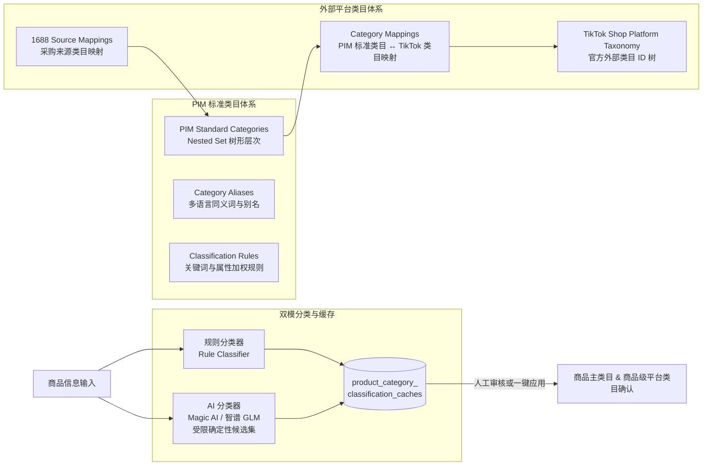
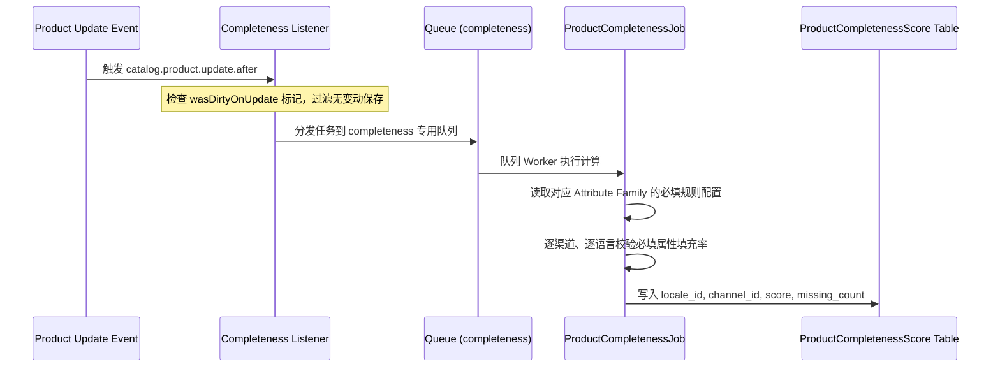
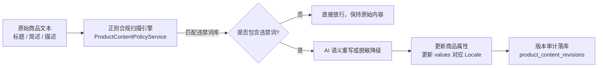

# UnoPim 当前系统架构说明 (System Architecture Specification)

本文档详细说明 UnoPim 系统的全景架构、模块划分、数据流动模式、核心子系统设计及技术实现规范。

---

## 1. 总体架构概览 (High-Level Architecture)

UnoPim 采用**模块化单体 (Modular Monolith)** 架构设计，基于 **Laravel 13** 与 **PHP 8.4**，依托 **Konekt Concord** 模块框架将业务领域解耦为高内聚、低耦合的独立包（Packages）。同时针对十万至千万级海量商品目录场景，系统在底层结合了关系型数据库（MySQL/PostgreSQL/MariaDB）、Elasticsearch 8.x 检索引擎、Redis 异步任务队列与多层缓存架构。



---

## 2. 模块化机制与扩展体系 (Modular Monolith & Concord)

### 2.1 模块自治结构
所有业务模块放置在 `packages/Webkul/<ModuleName>`，严格遵循统一的代码结构：
- `src/Config/`: 模块配置（ACL 权限树、菜单项、自定义驱动、事件绑定）。
- `src/Contracts/`: 领域实体接口契约，实现模块间解耦依赖。
- `src/Database/`: 模块独立的迁移文件 (`Migrations`)、数据填充 (`Seeders`) 和模型工厂 (`Factories`)。
- `src/Http/`: 控制器、中间件、表单验证请求 (`Requests`)、API 资源 (`Resources`)。
- `src/Models/`: Eloquent 模型实体与 Concord 代理类 (`Proxy`)。
- `src/Providers/`: 模块服务提供者（`ModuleServiceProvider` 和 `<Module>ServiceProvider`）。
- `src/Repositories/`: 仓储实现（继承 `Webkul\Core\Eloquent\Repository`）。
- `src/Resources/`: 视图模板 (Blade / Vue) 与多语言翻译资源。

### 2.2 模型代理与解耦 (Concord Proxy Pattern)
UnoPim 禁止跨模块硬编码模型类名，统一通过 Concord Proxy 解析：
```php
// 正确范式：使用 Proxy 获取实际绑定的模型类或实例化
use Webkul\Product\Models\ProductProxy;
use Webkul\Attribute\Models\AttributeFamilyProxy;

$productClass = ProductProxy::modelClass();
$product = ProductProxy::create($attributes);
```
此模式支持上层企业版或第三方插件通过服务容器无缝重写（Override）核心模型与关系，无需篡改基础代码。

---

## 3. 商品与多维属性数据架构 (Catalog & Product Data Architecture)

### 3.1 核心列与动态 EAV 值的混合存储
面对千万级商品与数百个动态属性的高性能挑战，UnoPim 摒弃了传统的实体-属性-值 (EAV) 多行多表关联方案，采用**核心物理列 + JSON 动态分片**的混合存储模型：

| 数据分片 | 存储载体 | 适用场景 | 示例字段 |
| :--- | :--- | :--- | :--- |
| **Identity Columns** | 物理表 `products` 独立字段 | 检索、唯一标识、外键关联、高频状态过滤 | `id`, `sku`, `type`, `parent_id`, `attribute_family_id`, `status`, `variant_structure_id` |
| **common** | `products.values` JSON | 全局通用属性，不受渠道与语言影响 | 品牌 (brand)、重量 (weight)、尺寸 (dimensions)、条码 (barcode) |
| **locale_specific** | `products.values` JSON | 随语言/地区变化，与销售渠道无关 | 基础名称 (name)、多语言描述 (description)、多语言规格 |
| **channel_specific** | `products.values` JSON | 随销售渠道变化，与语言无关 | 渠道特有标签、渠道定价开关 |
| **channel_locale_specific** | `products.values` JSON | 同时随渠道与语言独立变化 | 特定渠道（如独立站 vs 亚马逊）的 localized title、SEO 描述 |

### 3.2 变体商品与继承模型 (Variant Structures & Inheritance)
1. **商品类型**:
   - `simple`: 独立基础商品或可作为变体子商品。
   - `configurable`: 可配置主商品，持有变体坐标轴与变体结构。
2. **变体坐标轴 (`variant_structure_axes`)**:
   - 支持单轴（如颜色）或多层复合轴（如颜色 + 尺码）。
3. **运行时动态继承 (`resolvedValues`)**:
   - 子变体商品在读取属性时，通过 `VariantValueResolver` 执行继承计算：自根节点向叶子节点逐级覆盖，避免在数据库中重复冗余父级商品公共数据。
4. **统一商品展示名解析 (`displayName`)**:
   - 具有明确的兜底优先级：`channel_locale_specific` → 当前语言默认渠道 → `locale_specific` → `common.name` → 语言候选集 → `sku`。

---

## 4. 标准类目、平台映射与双模分类引擎 (Category & Taxonomy Architecture)

UnoPim 构建了面向跨境电商全链路的标准化类目体系与外部电商平台（如 TikTok Shop）映射机制：



### 4.1 类目树结构 (Nested Set)
- 使用 `kalnoy/nestedset` 维护 PIM 标准类目树，支持海量类目的高速单次查询获取整棵子树 (`_lft`, `_rgt`, `parent_id`)。
- 类目支持自定义动态字段 (`category_fields`)。

### 4.2 平台类目与外部映射
- **`platform_taxonomies` 与 `platform_categories`**: 存储外部平台（例如 TikTok Shop MY）的官方类目树结构与外部 ID (`external_id`)。
- **`category_mappings`**: 建立 PIM 标准类目到平台类目的映射关系，支持精确映射、条件映射、优先级与置信度。
- **`category_source_mappings`**: 记录上游数据源（例如 1688）的来源类目到 PIM 标准类目的自动映射转换。

### 4.3 双模分类体系 (Rule vs. AI)
1. **规则分类器 (`ProductCategoryRuleClassifier`)**:
   - 依赖 1688 映射、类目多语言别名 (`category_aliases`)、关键词匹配与权重规则 (`category_classification_rules`)，输出精确、高置信度的推荐类目。
2. **AI 分类器 (`ProductCategoryAiClassifier`)**:
   - 采用**受限确定性候选集 (Bounded Deterministic Candidate Set)** 机制：
   - 本地基于商品摘要（标题、属性、现有类目）预先召回有限候选集，仅将候选列表发送给大语言模型（如智谱 GLM 通用 API）。
   - 强制 Prompt 约定必须且仅能从候选 ID 中做出选择，严格校验返回结果合法性，杜绝模型幻觉产生无效类目 ID。
3. **隔离缓存与审核生效**:
   - 分类建议写入 `product_category_classification_caches` 缓存表。
   - 必须通过后台管理人员“使用此结果”确认，或批量审核后，才最终更新 `products.values` 及 `product_platform_category_assignments`。

---

## 5. 多币种与自动化汇率引擎 (Exchange Rate Architecture)

针对跨境电商多币种核算与销售定价需求，UnoPim 实现了独立的汇率自动化服务：

```
[Frankfurter API]
       │
 (每 3 小时调度)
       ▼
[RefreshExchangeRates Command]
       │
   [ExchangeRateService]
       │
       ├─► 实时汇率库 (Real Rates) ─────► GET /api/v1/rest/exchange-rates
       └─► 商业销售汇率 (Selling Rates) ──► 导入计价换算 (CNY → USD, MYR, THB)
```

- **基准货币与目标币种**: 以人民币 (`CNY`) 为基准锚点，支持 `USD`、`MYR`、`THB` 等目标结算币种。
- **实时汇率抓取与二级容灾**:
  - 每 3 小时由调度器触发抓取。
  - 第一级：实时拉取最新外汇数据。
  - 第二级：若最新数据缺失，抓取前一日数据并计算均值。
  - 若前一日数据仍不可达，系统抛出 `RuntimeException` 中止本次刷新，保留本地最近成功记录不受影响。
- **双汇率机制**:
  - `Real Rate`: 真实的国际外汇牌价。
  - `Selling Rate`: 运营人员可在后台单独微调的销售结算加价汇率；商品导入时根据销售汇率自动换算各币种价格。

---

## 6. 高性能数据传输与流式导入导出 (DataTransfer Engine)

针对数十万乃至数百万行商品、类目和属性的批量交换，UnoPim 构建了流水线批处理体系：

1. **底层流式缓冲器 (`FileBuffer`)**:
   - 基于文件系统的临时缓冲区，避免将大型 CSV/XLSX 数据完全载入内存，保证恒定的内存占用 (`O(1)` 内存复杂度)。
2. **批处理分块 (`job_batches`, `job_instances`, `job_track`)**:
   - 任务被拆分为离散的数据 Chunk 批次并行处理，记录步进日志和错误详情。
3. **心跳与故障自愈 (`TracksJobHeartbeat`, `ReapStalledJobsCommand`)**:
   - 运行中任务定期上报心跳时间戳；系统调度器自动发现因容器重启、超时崩溃导致的僵尸任务并标记重试或终止。
4. **性能加速优化**:
   - 导入期间支持暂缓 Elasticsearch 实时索引与暂缓完整度评分计算，待全部批次完成后执行一次性聚合刷新。

---

## 7. 双层人工智能体系 (MagicAI & AI Agent Architecture)

### 7.1 Magic AI 平台层 (Provider Abstraction)
- **多平台接入**: 支持 OpenAI、Anthropic Claude、Google Gemini、DeepSeek、智谱 AI (GLM)、Groq、Ollama、xAI 等 10+ 提供商及自定义 OpenAI-Compatible 协议。
- **安全凭证管理**: 所有外部 API Key 均经过数据库层 AES-256 加密保存 (`magic_ai_platforms.api_key`)。
- **动态模型发现**: 后台可一键测试平台连通性并实时抓取平台最新模型清单。
- **核心任务代理**:
  - `MagicContentAgent`: 商品标题、卖点、SEO 描述生成。
  - `TranslationAgent`: 结构化、保留 HTML 标签的多语言批量属性翻译。

### 7.2 AI Agent 交互式协同层 (Autonomous Copilot)
- **Agent 运行时 (`BoundedAgent`, `AgentRunner`)**: 提供类 Chat 交互模式，将用户的自然语言意图转换为结构化操作步骤。
- **工具注册中心 (`ToolRegistry`)**:
  - 内置 20+ 项 PIM 原生工具（`AssignCategories`, `CreateProduct`, `BulkEdit`, `CatalogSummary`, `ExportProducts` 等）。
- **权限安全边界 (`ChecksPermission`, `QueuesForApproval`)**:
  - 严格校验当前操作用户的 ACL 权限，高危操作（如批量删除、全量重置）强制挂起并请求人工审批确认。

---

## 8. 商品信息完整度计算引擎 (Product Completeness)



- **规则配置 (`completeness_settings`)**: 管理员按“属性族 + 销售渠道”为粒度定义必填属性集合。
- **变体结构感知 (`VariantStructurePlanner`)**: 正确识别变体主商品与子商品的属性归属权，避免将仅属于变体子商品的必填项误判为主商品缺失。
- **增量防抖机制**: 利用 `wasDirtyOnUpdate` 瞬态标记，仅在属性值真实变更时派发异步计算，避免无意义的队列拥堵。

---

## 9. 数字商品护照与发布体系 (DPP & Publication)

- **数字商品护照 (Digital Product Passport - DPP)**:
  - 符合欧盟循环经济与合规标准的数字护照体系。
  - 支持护照模板配置（Sections、Fields、Roles、Tiers）、公开层与内部层权限分离、自动生成二维码承载体 (QR Carrier) 与标准 JSON-LD 结构化数据。
- **发布渠道 (`Webkul\Publication`)**:
  - 实现商品数据的快照式版本化发布（`publication_versions`、`publication_version_payloads`）。
  - 版本发布后具备不可篡改性 (Immutable Version)，支持版本撤回 (Withdraw)、重放 (Reinstate) 与全链路交付记录审计。

---

## 10. 开放接口与系统集成架构 (AdminApi & External Integration)

### 10.1 身份认证体系
- **OAuth2 规范**: 基于 Laravel Passport，支持密码模式 (Password Grant) 与客户端凭证模式 (Client Credentials Grant)。
- **个人 API Token**: 支持基于 Sanctum 的长效 API Token。
- **开箱即用集成初始化**:
  - 提供 `php artisan unopim:integration:pim-provision` 幂等命令，自动化配置内部微服务系统（如 `product-info-management`）所需的专有 OAuth 客户端与 API 用户。

### 10.2 受保护媒体文件流
- 提供受鉴权保护的高性能文件下载接口：`GET /api/v1/rest/media-files/download`。
- 采用二进制流式传输 (`BinaryFileResponse`)，具备 MIME 类型自动识别、ETag 校验与浏览器/网关 HTTP 缓存头。

### 10.3 事件驱动 Webhooks
- 基于观察者模式监听商品与目录生命周期事件。
- 所有对外 HTTP 推送均通过 `webhooks` 队列异步执行，并提供完备的重试机制与调用日志记录 (`webhook_logs`)。

---

## 11. 跨境电商工作台与内容风控合规体系 (Cross-Border Workbench & Compliance Engine)

### 11.1 1688 商品采集工作台架构
- **任务调度与代理**:
  - `Collection1688Controller` 提供独立的前端工作台与管理面板，接收包含 Offer ID 的 1688 商品详情链接。
  - 通过 HTTP 异步向本地驻留的 PIM 采集微服务 (`127.0.0.1:8020/api/jobs/async-import`) 分发抓取流水线，默认注入 `MY` 目标地区及 `zh_CN` 语言。
- **任务生命周期与深度清理**:
  - 支持任务轮询、失败单键重试及源链接热修改。
  - 删除任务时支持级联调用下游端点彻底清理本地临时 HTML 网页与已下载的媒体资产。

### 11.2 商品内容合规与修订审计引擎

- **违禁词库管理 (`content_policy_forbidden_words`)**: 支持后台维护与外部系统 REST 批量同步，数据层强制小写归一化去重。
- **高吞吐扫描与容灾降级**: 预处理剥离 HTML 标签后执行正则匹配；优先调度 Magic AI 重写中和敏感词；AI 离线或超时自动降级为精准星号/中性词脱敏（标记为 `ai_fallback`），保证业务上架主链路不阻塞。
- **修订审计 (`product_content_revisions`)**: 商品属性持久化后顺序写入审计快照，完整记录优化前后对比、操作地区、语言及所用模型，在编辑页提供差异高亮视图。

### 11.3 TikTok Shop 多地区上架自动化与状态机
- **自动化并发调度**:
  - 支持面向东南亚多地区（MY、TH、SG、PH、VN 等）发起草稿上架或直接提交审核，调度外部无头浏览器自动化流水线。
  - 提供实时取消 (`/listing/cancel`) 端点，可在上架卡顿或发现错误时紧急刹车。
- **上架履历与状态展示 (`product_listing_histories`)**:
  - 持久化每次上架尝试的 Attempt ID、地区、状态、发布链接及执行耗时。
  - 商品编辑页提供全景“上架历史”抽屉，主商品表格列实时以状态徽标展示最新上架结果。
- **上架异常生命周期治理 (`product_listing_exceptions`)**:
  - 自动捕获上架中断的错误码与详情，区分阻塞性与警告级别；运营人员可在前端面板勾选“已解决”，实现异常闭环。

### 11.4 商品图片多语言翻译子系统
- **架构流转 (`product_image_translations`)**:
  - 提取商品主图与画廊图中的文字，调用多语言翻译服务将其渲染为当地语言版本（如泰文、马来文、英文、印尼文、越南文）。
  - 后台提供原图与译图并排联动对比面板，并支持双击查看器进行高分辨率无损放大。

