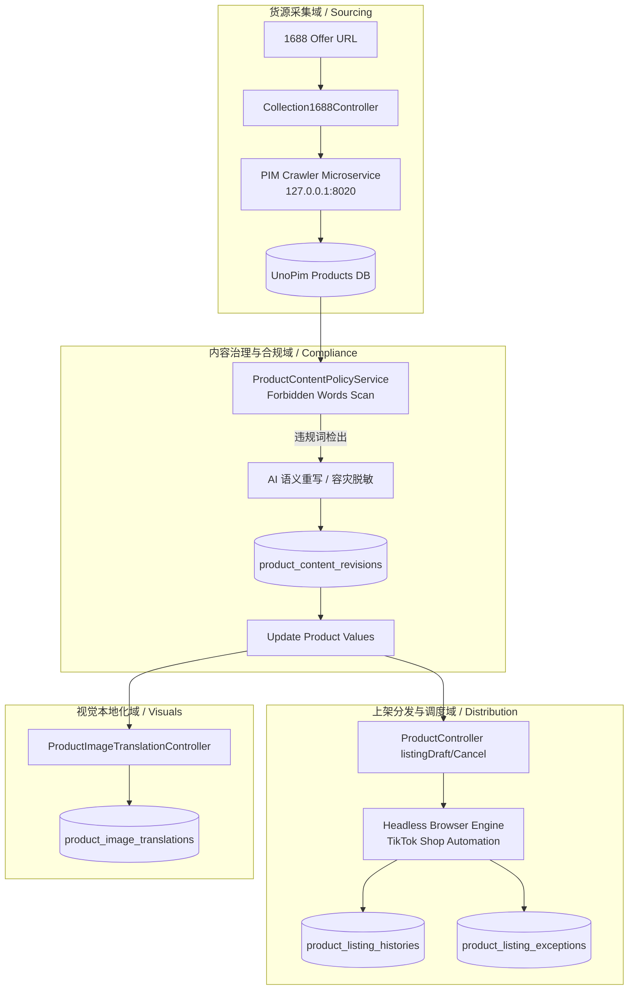

# 技术方案设计：跨境电商工作台、1688采集与合规体系 (Design)

## 架构拓扑 (Architecture Topology)

## 数据模型设计 (Data Model Design)

1. **`content_policy_forbidden_words`**:
   - `id`: BIGSERIAL PRIMARY KEY
   - `term`: VARCHAR(255) - 原始词
   - `normalized_term`: VARCHAR(255) UNIQUE - 小写归一化索引
   - `status`: BOOLEAN - 启停状态
   - `notes`: VARCHAR(500) - 备注

2. **`product_content_revisions`**:
   - `id`: BIGSERIAL PRIMARY KEY
   - `product_id`: BIGINT REFERENCES products(id) ON DELETE CASCADE
   - `platform`: VARCHAR(32) DEFAULT 'tiktok'
   - `region`: VARCHAR(16)
   - `locale`: VARCHAR(16)
   - `matched_terms`: JSON - 命中的违规词列表
   - `original_content`: JSON - 优化前原始内容快照
   - `optimized_content`: JSON - 优化后合规内容快照
   - `provider`: VARCHAR(255) - AI 提供商
   - `model`: VARCHAR(255) - 模型名称
   - `method`: VARCHAR(32) DEFAULT 'ai' ('ai' 或 'fallback')

3. **`product_listing_exceptions`**:
   - `id`: BIGSERIAL PRIMARY KEY
   - `product_id`: INTEGER REFERENCES products(id) ON DELETE CASCADE
   - `sku`: VARCHAR(128)
   - `platform`: VARCHAR(32) DEFAULT 'tiktok'
   - `region`: VARCHAR(16)
   - `attempt_id`: VARCHAR(64)
   - `event_key`: VARCHAR(128)
   - `exception_type`: VARCHAR(64)
   - `stage`: VARCHAR(128)
   - `severity`: VARCHAR(16) DEFAULT 'warning'
   - `blocking`: BOOLEAN DEFAULT FALSE
   - `requires_manual`: BOOLEAN DEFAULT FALSE
   - `details`: JSON
   - `resolved_at`: TIMESTAMP NULLABLE

4. **`product_listing_histories`**:
   - `id`: BIGSERIAL PRIMARY KEY
   - `product_id`: INTEGER REFERENCES products(id) ON DELETE CASCADE
   - `sku`: VARCHAR(128)
   - `platform`: VARCHAR(32) DEFAULT 'tiktok'
   - `region`: VARCHAR(16)
   - `attempt_id`: VARCHAR(64)
   - `listing_type`: VARCHAR(16) ('draft' 或 'submit')
   - `status`: VARCHAR(64)
   - `draft_url`: TEXT
   - `seller_url`: TEXT
   - `error`: TEXT
   - `started_at`, `completed_at`: TIMESTAMP

5. **`product_image_translations`**:
   - `id`: BIGSERIAL PRIMARY KEY
   - `product_id`: INTEGER REFERENCES products(id) ON DELETE CASCADE
   - `sku`: VARCHAR(128)
   - `region`: VARCHAR(16)
   - `locale`: VARCHAR(16)
   - `image_type`: VARCHAR(32) DEFAULT 'gallery'
   - `original_url`: TEXT
   - `translated_url`: TEXT
   - `local_path`: TEXT
   - `variant_sku`: VARCHAR(128)
   - `sort_order`: INTEGER
   - `metadata`: JSONB

## 接口协议设计 (API Protocols)

- `GET /api/v1/rest/content-policy/forbidden-words`: 查询违禁词库
- `POST /api/v1/rest/content-policy/forbidden-words/sync`: 批量同步违禁词
- `POST /api/v1/rest/content-policy/products/{sku}/optimize-description`: API 触发描述合规重写
- `GET/POST /api/v1/rest/magic-ai/system-prompts/sync`: 双向同步用途系统提示词
- `POST /api/v1/rest/listing-history/products/{sku}`: 上报上架执行履历
- `POST /api/v1/rest/listing-exceptions/products/{sku}`: 上报上架异常事件
- `GET /api/v1/rest/products/{sku}/image-translations`: 查询多语言译图列表
